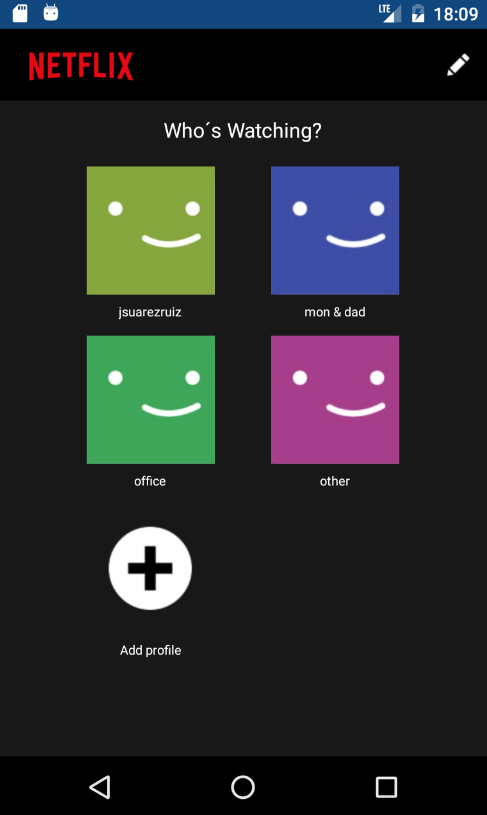
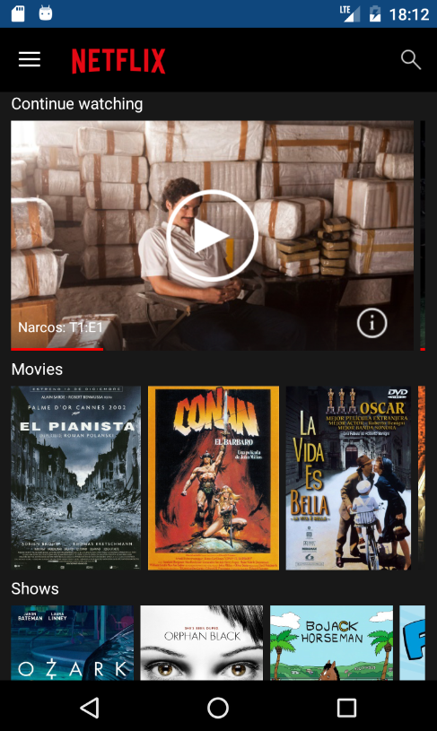
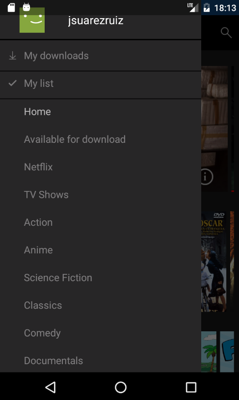
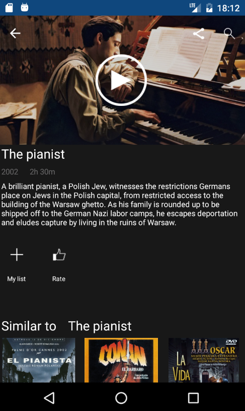

# Xamarin.Netflix

A **Xamarin.Forms** version of the **Netflix** app to prove you can create goodlooking UI with Xamarin.Forms.

## Tools used

- [FFImageLoading](https://github.com/luberda-molinet/FFImageLoading) – Caching and transforming images.
- [Xamarin Forms Toolkit](https://github.com/jamesmontemagno/xamarin.forms-toolkit) - Toolkit for Xamarin.Forms with helpers, converters, etc. 
- [FlowListView](https://github.com/daniel-luberda/DLToolkit.Forms.Controls/tree/master/FlowListView) - ListView derivative with flowing, grid-like columns support.

And nothing more?. No, little more. Everything else is taking advantage of the options included in Xamarin.Forms. 

There are a **85,87% of code shared in Android**. Only a 14,13% of specific Android code.
In **iOS we have 89.53% of shared code**. Only 10.47% ios specific code.

## The result

**Android**

   

**iOS**

   

## Notes

The purpose of this demo is simply to show how you can create nice UI in Xamarin.Forms. Netflix is used as a reference but no real data or any other details of Netflix are used.

## Setup

Download or clone the repository. This is a solution with two projects.

Rebuild the solution to get all neccesary NuGet packages.

**Enjoy!**

## Copyright and license

Code released under the [MIT license](https://opensource.org/licenses/MIT).